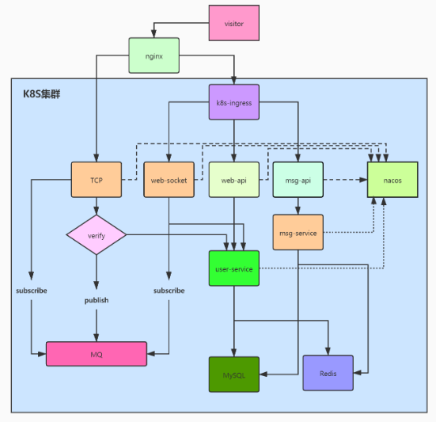

# 基于dubbo分布式聊天系统实现

## 模块说明

1. dubbo-commons 通用Bean定义。
2. dubbo-api 定义接口。
3. dubbo-api-web webapi (consumer) 接口定义。
4. dubbo-message-service (provider) 消息服务处理。
5. dubbo-netty-gateway (standalone)  tcp网关接入。
6. dubbo-user-service (provider) 用户服务，实现用户信息， 用户登录(可以考虑再拆一个服务)业务。

## 大致逻辑

1. 调用 [post] dubbo-app-web /user/login 登录获得JWTToken。

```json
{
  "username": "luowen",
  "password": "abc123"
}
```

2. 调用 [post] dubbo-app-web /mesg/send 发关消息, 消息发送到 redis 的 channel 中， 对应 dubbo-netty-gateway 有监听 redis channel 消息。
   根据消息的的`receiver`获得socket，再向socket发送消息体。 redis的 channel 实现可以使用 activemq 中间件代替。 考虑能够分布式剥离，使用消息中间件来解耦. 耦。

```json
{
  "sender": 1,
  "receiver": 2,
  "content": "hello chatx"
}

```

3. 用户连上后， 也可以使用自定义消息体，通过 socket 发送。

```
4字节： 包长
4字节： 消息ID  // 1: chat消息发送， 10：用户登录。
4字节： 消息版本
8字节： 保留 
byte[]: 消息体 // json 序列化数据， MsgDTO

```

## 整体架构



## TOOD

1. websocket 实现。
2. 用户信息补全。
3. 登录下线。
4. ....